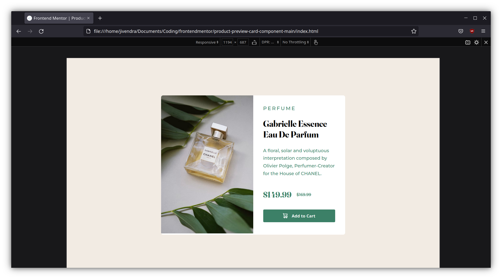
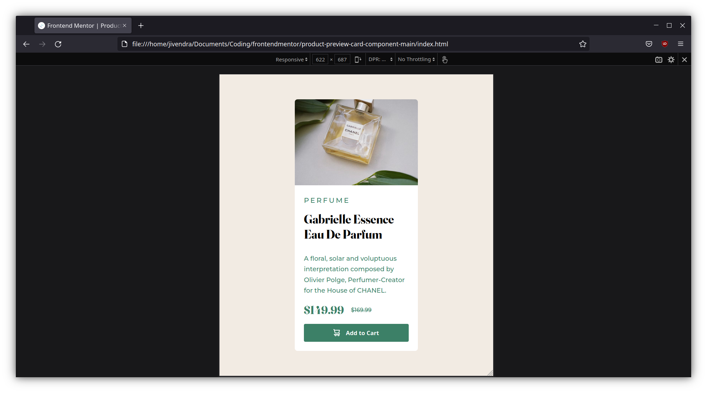

# Frontend Mentor - Product preview card component solution

This is a solution to the [Product preview card component challenge on Frontend Mentor](https://www.frontendmentor.io/challenges/product-preview-card-component-GO7UmttRfa). Frontend Mentor challenges help you improve your coding skills by building realistic projects. 

## Overview

### The challenge

Users should be able to:

- View the optimal layout depending on their device's screen size
- See hover and focus states for interactive elements

### Screenshot

### Links

- [Solution URL](https://github.com/jivendra/frontendmentor/tree/main/product-preview-card-component-main)
- [Live site URL](https://7de9d34c.product-preview-card-component-jivendra.pages.dev/)

## My process

### Built with

- Semantic HTML5 markup
- CSS custom properties
- Flexbox
- CSS Grid
- Mobile-first workflow

## Author

- Website - [Jivendra Sah](https://jivendrasah.com)
- Frontend Mentor - [@jivendra](https://www.frontendmentor.io/profile/jivendra)
- Twitter - [@jivendra_sah](https://twitter.com/jivendra_sah)

